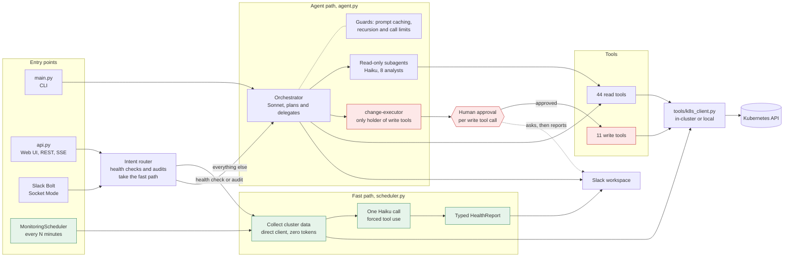
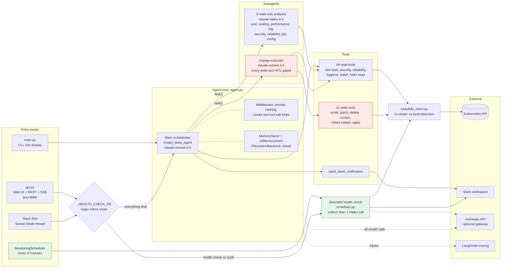
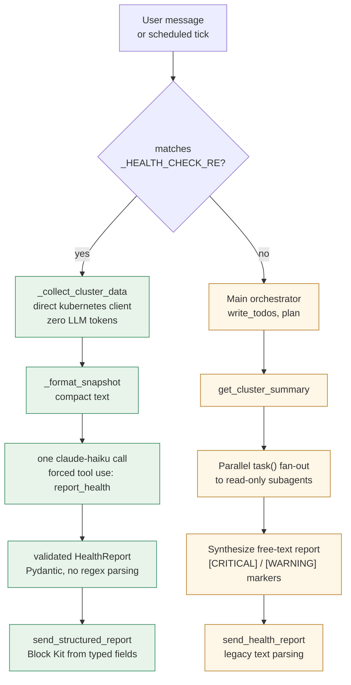
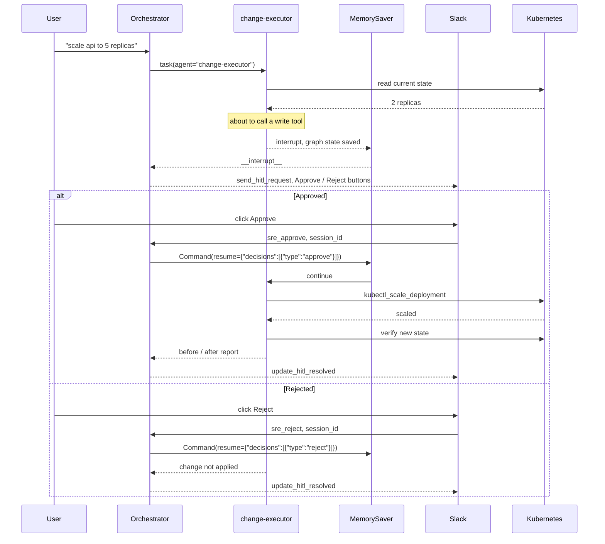
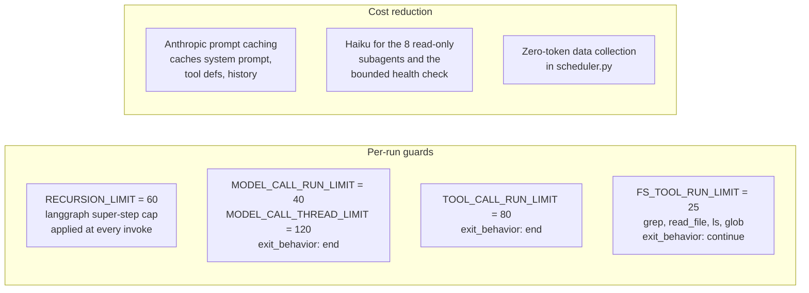

# SRE Bot architecture

How the pieces fit together, covering entry points, the two request paths, the
subagent fan-out, and the human-in-the-loop approval cycle.

Rendered PNGs of each diagram live alongside this file for use outside GitHub,
in slides, the blog post, or anywhere Mermaid does not render. They are
`sre-bot-architecture-simple.png`, `sre-bot-architecture-overview.png`,
`sre-bot-request-paths.png`, `sre-bot-hitl-sequence.png`, and
`sre-bot-cost-safety.png`. Regenerate them with the command below.

```bash
npx -p @mermaid-js/mermaid-cli mmdc -i diagram.mmd -o out.png -b white -s 3
```

## Simplified overview

The version to read first, and the one to put on a slide. It keeps the four
entry points, both request paths, the subagent split, and the approval gate,
and leaves out the storage and observability wiring. Source is
`sre-bot-architecture-simple.mmd`.



Note that the CLI bypasses the router and always goes to the orchestrator; only
the web and Slack entry points are routed. Everything below adds detail to this
picture. The component overview adds the checkpointer, filesystem backend, and
the Anthropic and LangSmith edges, the two request paths expand the routing
decision, and the HITL sequence expands the approval gate.

## Component overview



## Two request paths

A health check and a diagnosis are handled very differently. The distinction
exists because fanning out to subagents can exceed the langgraph recursion
limit, so periodic and on-demand health checks take a path with a fixed step
count instead.



The left path is bounded, costs roughly one Haiku call, and returns a typed
`HealthReport`. The right path is an unbounded fan-out over many Sonnet and Haiku
calls, and returns free text that downstream code parses.

## Human-in-the-loop approval

Write tools exist only on the change-executor subagent. The main agent holds no
write tools at all, so a mutation cannot bypass approval. Every one of the 11
write tools is listed in `interrupt_on`, which pauses the graph before the call
executes.



The same interrupt and resume cycle is driven from three places, namely Slack
buttons (`sre_approve` / `sre_reject`), REST endpoints (`/api/approve`,
`/api/reject`, `/api/edit`), and the CLI loop in `main.py`. All of them resume
the same langgraph thread by `thread_id`.

## Cost and loop safety

Controls added after a runaway filesystem loop, all configured in `config.py`
and applied in `agent.py::_build_middleware`.



`exit_behavior` differs on purpose. Hitting the global caps ends the run, while
hitting the per-tool filesystem cap only blocks that tool, so the agent can
still summarize what it already found.

## Notes on the current wiring

Two things are true of the code as drawn and are worth knowing when reading it.

- `tools/__init__.py` exports `WRITE_TOOLS` (18 tools) and `WRITE_TOOL_NAMES`,
  but nothing imports either. The change-executor imports its 11 write tools
  directly, so 7 exported write tools are not reachable by any agent. Those are
  `kubectl_patch_configmap`, `kubectl_rollback_deployment`,
  `kubectl_apply_custom_resource`, `kubectl_delete_resource`,
  `helm_upgrade_release`, `helm_rollback_release`, `helm_add_repo`.
- The orchestrator path and the bounded path produce different output
  contracts. The bounded path returns a typed `HealthReport`, while the
  orchestrator returns free text with `[CRITICAL]` markers that downstream code
  parses with regex and substring matching.
